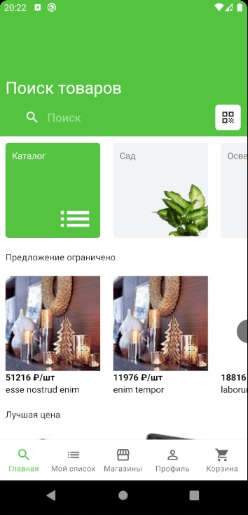

## Главная страница:
* Основной экран
* Генерация товаров на основе "Lorem Ipsum"
* Обновление данных через SwipeRefreshLayout
* При клике по товару показывается Toast
* При клике по каталогу открывается фрагмент с категориями
* При клике по категории открывается фрагмент с ExpandableListView (Написал свой адаптер, но кастомизировать как в приложении не получилось, скорее всего надо было делать через RecyclerView)
* Раскрывается всегда только один список, как в приложении, но без анимации

